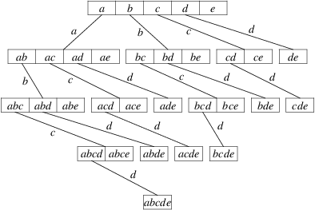

# Background

The market-basket problem is a highly researched data mining problem
aimed at identifying the most popular groups of items purchased from 
a list of transactions. The support for a group of items (an itemset)
is defined as the number of transactions that contain every item in
the itemset. The kinds of algorithms I'm interested in for this project
try to answer the question, "given a minimum support, what are all of
the itemsets that occur in transactions at least that many times?". 
The results of such algorithms can be used directly by businesses to
ascertain what products act most like complements and indirectly to
figure out how to recommend other products to a user for a given set
of items in their shopping cart. 

The most naive possible solution to this problem is to iterate
through each itemset in the powerset of the set of all items,
and for each itemset to search the entire transaction list.
This has exponential complexity with respect to the number of
items. Thus, it is unsuitable for anything.

The most basic algorithm that improves upon this problem is the 
Apriori which prunes the exponential search space using the
principle of "subset-infrequency": if an itemset is known to be
infrequent, then its supersets must also be infrequent. The strategy
then becomes as follows:

```
freq_itemsets = []
candidates <= the set of all 1-itemsets
for i in [1..N]:
  -- Pruning step.
  freq_k_itemsets <= filter (\item -> support(item) <= minsupport) candidates
  freq_itemsets <= freq_itemsets ++ freq_k_itemsets
  candidates <= genCandidates(candidates)
```
where k-itemsets are itemsets with k items, 
K is the number of items,
and N is the length of the largest transaction.

Above, genCandidates works as follows:

```
def genCandidates(k_itemsets):
  k_plus_one_itemsets = []
  for itemset in k_itemsets:
    max_item <= maximum item id of k_itemsets
    t <= [(max_item+1)..K]
    for item in t:
      append (k_plus_one_itemsets `union` {item}) to k_plus_one_itemsets
  return k_plus_one_itemsets
```

# Proposal
I want to implement the Apriori algorithm above with certain optimizations
that make it more interesting for the purposes of a final project.

The first one I want to implement
is that I want to calculate the support of a given itemset using
tidlists---rather than storing the data as a list of transactions, 
I want to store it as a map from item id's to the transactions containing that 
item. We call the values they map to "tidlists", except when these are 
implemented as sets they can yield great performance advantages for calculating
support. For example, let's say we want to find the support of {1, 3, 5}. 
Rather than iterating through all of the transactions and checking each
to see if they contain 1, 3, and 5, we can instead take the intersection 
of the tidlists corresponding to each item. This is way faster for a number of 
reasons, such as the fact that the map-method doesn't even consider transactions
that don't contain any of the items of interest.

The second I want to implement requires a reframing of the apriori 
algorithm given above, as it obscures the tree-like nature of the search.
Below is the search as described thus far:

&nbsp;&nbsp;&nbsp;&nbsp;&nbsp;&nbsp;&nbsp;
{width=50%, margin=3cm}
(stolen from Christian Borgelt)

Above, we see that after finding the supports of the 1-itemsets, we generate
2-itemset candidates on all the 1-itemsets we find to be frequent.
The Max-Miner variation on Apriori recommends instead keeping track,
for each node in the tree, the items not yet considered in that path 
($t(g)$ for node $g$). 
In the photo there's no need to keep track, as $t(g)$ is just the closed 
interval from the largest id to K. 
We can also notice that the left-most nodes in the graph are responsible
for the biggest explosions in candidate generation.
This inspires the Max-Miner observation: if we instead ordered the "tail items" 
by support (ascending order), we can make the left-most nodes on the graph those
with the lowest support, thus increasing the chance that the candidates they 
generate are frequent and thus decreasing the number of generated candidates.

There is another optimization that we can do that I may or may not implement, 
based on the principle of "superset-frequency": if an itemset is known to be
frequent, then all of its subsets must also be frequent. The Max-Miner
algorithm uses this fact to occasionally check the support of some large 
itemsets to skip generating subsets if they turn out to be frequent.

# Correctness and Benchmarking
Christian Borgelt has written really fast code that solves this problem in C. 
I will use the outputs of his solution on common datasets as references.

