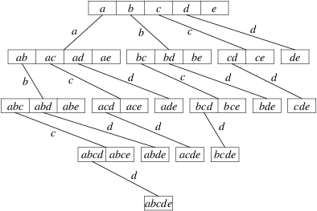

---
title:  'Apriori (ECLAT + Max-Miner) in Haskell'
author: Daniel Indictor (di2215)
geometry: margin=2cm
...

# The Algorithm

The market-basket problem is a highly researched data mining problem
aimed at identifying the most popular groups of items in 
a list of transactions. The support for a group of items (an itemset)
is defined as the number of transactions that contain every item in
the itemset. The kinds of algorithms I'm interested in for this project
try to answer the question, "given a minimum support, what are all of
the itemsets that occur in transactions at least that many times?". 
The results of such algorithms can be used directly by businesses to
ascertain what products act most like complements and indirectly to
figure out how to recommend other products to a user for a given set
of items in their shopping cart. 

The most naive possible solution to this problem is to iterate
through each itemset in the powerset of the set of all items,
and for each itemset to search the entire transaction list.
This has exponential complexity with respect to the number of
items. Thus, it is unsuitable for anything.

The most basic algorithm that improves upon this problem is the 
Apriori which prunes the exponential search space using the
principle of "subset-infrequency": if an itemset is known to be
infrequent, then its supersets must also be infrequent. The strategy
then becomes as follows:

```
freq_itemsets = []
candidates <= the set of all 1-itemsets
for i in [1..N]:
  -- Pruning step.
  freq_k_itemsets <= filter (\item -> support(item) <= minsupport) candidates
  freq_itemsets <= freq_itemsets ++ freq_k_itemsets
  candidates <= genCandidates(candidates)
```
where k-itemsets are itemsets with k items, 
K is the number of items,
and N is the length of the largest transaction.

Above, genCandidates works as follows:

```
def genCandidates(k_itemsets):
  k_plus_one_itemsets = []
  for itemset in k_itemsets:
    max_item <= maximum item id of k_itemsets
    t <= [(max_item+1)..K]
    for item in t:
      append (k_plus_one_itemsets `union` {item}) to k_plus_one_itemsets
  return k_plus_one_itemsets
```

## Optimization 1: ECLAT

What's not specified above is how we the support of an itemset. 
The traditional approach is to simply read through all the transactions,
counting the amount that contain all of the items in the itemset of interest. This is slow for obvious reasons and lends us to our first optimization:
rather than keeping a list of transactions containing items, we can keep a map of items to ID's of transactions containing those items. For example, the following simple data would be transposed as follows:
```
t1: 1 2 3
t2: 2 4
t3: 3 4
t4: 1 2 5
t5: 1 2 3 4
```
becomes `{1: {t1, t4, t5}, 2: {t1, t2, rt, t5}, 3: {t1, t3, t5}, 4: {t2, t3, t5}, 5: {t4}}`

Once we have this tidmap, we can easily find the support of any itemset by looking up the tids for each of its items, intersecting those sets, and counting the total---that is, the number of tid's they have in common.

## Optimization 2: Max-Miner Algorithm

The [Max-Miner algorithm](http://www09.sigmod.org/disc/disc99/disc/sigmod_papers/slisp_efficiently_mining_l/slides.pdf)
 concerns itself moreso with the way the "search tree" is arranged and which itemsets are checked. Traditionally, the search tree looks like the image below:

{width=50%, margin=3cm}
(stolen from Christian Borgelt)

In the image, we can see that the leftmost nodes are responsible for the biggest "combinatorial explosions" and have the greatest amounts of child nodes. Anything we could do to minimize the chance that the leftmost nodes expand would greatly decrease the total amount of candidates that have to be generated. The central insight (as far as I can tell; I only read the linked slideshow) of the Max-Miner algorithm is to order the candidate children of each node such that the child nodes occur in order of increasing support. This means that the candidates with the least support, which have the lowest chance of having frequent children themselves, will be less likely to contribute to the "combinatorial explosion" effect. The linked paper provides precise terminology for these terms, so you may wanna read that if this explanation is confusing.

# Implementation-level Optimization, Parallelization, and Benchmarks
*Note*: While I ran this algorithm on a couple of test cases, all numbers and benchmarks reported below are based on an evaluation of the algorithm on the file `fixtures/T40l10D100K.dat` (a common dataset from Oracle for researchers to compare their work) at a minimum support level of 1% (meaning it was tasked with finding all the itemsets that appear in at least 1 percent of transactions).

## Parallelizing file reading and the TIDMap
The file reading went through many iterations (see Git log in submitted `.tar.gz`). 
The initial implementation read the input file, broke it up into lines and words, converted the words to Ints, and then immediately returned once it had done so. The first thing I did to improve it was switch to `ByteString`s which improved the performance significantly, though it involved writing custom conversion code from `ByteString` to a list of transactions. I tried to parallelize this conversion to make sure the program was continuously reading the file in, but this was more effort than it was worth because it led to significant garbage collection delays as the transactions were thrown out upon conversion to the tidmap. The solution I currently have is to create mini-TIDMaps (say, representing 1000 lines at a time) and evaluate those in parallel. These mini-TIDMaps are then combined into the full TIDMap using a custom fold function. This improved the time the program took to go from start to TIDMap from 10 seconds (first solution) to 3 seconds (second solution) to .7 seconds (current solution).


## Parallelizing the search
Rather than the iterative algorithm given above, I used an explicit search tree (called `ITree` in the code) which allowed easy parallelization
because I was able to decouple the search from the evaluation using `Control.Parallel.Strategies`. Basically, for each node in the tree, I chunked up the evaluation of its children and evaluated the chunks in parallel. This code parallelized super well, yielding productivities of about 95% according to Threadscope.

## Implementing Max-Miner
On my 4-core 8-thread laptop, rearranging the order of child evaluation improved the overall runtime from 70 seconds to about 7. I also found that the change made the spark execution times far more regular, so far fewer cores waited around at the end of the evaluation waiting for the rest to finish.

# Benchmarking
{width=50%, margin=3cm}

The algorithm scales really good. I didn't compare my implementation of ECLAT to Christian Borgelt's due to (1) time constraints and (2) I already know from previous experience that his implementation is at least an order of magnitude faster, as there's no chance my beginner's Haskell can compare to his hand-tuned C.

# Code Listings
The code is set up as a cabal app. 

## `haskell-market-basket.cabal`
I've cut out useless comments in this file.
```cabal
cabal-version:      2.4
name:               haskell-market-basket
version:            0.1.0.0

executable haskell-market-basket
    main-is:            Main.hs
    other-modules:      Utils, MoodyIntSet

    -- LANGUAGE extensions used by modules in this package.
    -- other-extensions:
    build-depends:    base >=4.14.3.0, 
                      containers >= 0.6, 
                      deepseq >= 1.4, 
                      parallel >= 3.0,
                      bytestring >= 0.11,
                      monad-loops >= 0.4,
    hs-source-dirs:   app
    default-language: Haskell2010
    ghc-options: -Wall -rtsopts=all -threaded -eventlog

```

## `app/Main.hs`

```haskell
module Main where

import Utils -- Factored out general(ish) functions for safekeeping.

import qualified Data.ByteString as B
import qualified Data.ByteString.Char8 as BC
import qualified Text.Read as Read
import qualified System.Exit as Exit
import qualified System.IO as IO
import qualified System.Environment as Environment
import qualified Data.IntMap as IntMap
import qualified Data.IntSet as IntSet
import qualified Data.Tree as Tree
import Control.Parallel.Strategies
import Control.Monad.Loops (whileM)
import Data.Foldable (foldl')
import Data.List (sortOn)

--
-- Core algorithm logic below.
--

type TIDMap = IntMap.IntMap IntSet.IntSet
type ITree = Tree.Tree Int

-- Terminology below comes from max-miner paper, except for "getOrders", which stands for 
-- "the set of transactions containing the itemset represented by this node."
data ISeed = ISeed { getLastItemInHead :: !Int, 
                     getTail :: ![Int], 
                    getOrders :: !IntSet.IntSet }
  deriving (Show, Eq)


genPruneCands :: Int -> TIDMap -> ISeed -> [(Int, IntSet.IntSet)]
genPruneCands minSup tidMap (ISeed _ unChildren orders) = 
  [ (candidate, candidateOrders) 
  | candidate <- unChildren -- Generate candidates
  , let candidateOrders = IntSet.intersection orders (tidMap IntMap.! candidate)
  , minSup <= IntSet.size candidateOrders  -- Pruning step
  ]

bootstrapGenPruneCands :: Int -> TIDMap -> [(Int, IntSet.IntSet)]
bootstrapGenPruneCands minSup = filter ((>=minSup) . IntSet.size . snd) . IntMap.toAscList 

maxMinerCandReorder :: [(Int, IntSet.IntSet)] -> [(Int, IntSet.IntSet)]
maxMinerCandReorder =  sortOn (IntSet.size . snd)

packCands :: [(Int, IntSet.IntSet)] -> [ISeed]
packCands candidates = let (items, orders) = unzip candidates
  in zipWith packSeed (headAndTails items) orders
  where packSeed (item, uncheckedItems) order = ISeed item uncheckedItems order

-- This function gives an expression (search tree) for frequent itemsets.
getFreqForest :: Int -> TIDMap -> [ITree]
getFreqForest minSup tidMap = Tree.unfoldForest blowup oneSeeds
  where 
    candGenPruner = genPruneCands minSup tidMap
    oneSeeds :: [ISeed]  -- One-itemsets are the base-case for search.
    oneSeeds = packCands $ maxMinerCandReorder $ bootstrapGenPruneCands minSup tidMap 

    blowup :: ISeed -> (Int, [ISeed])
    blowup seed = (getLastItemInHead seed, 
                   (packCands . maxMinerCandReorder . candGenPruner) seed)

-- Decouple parallelization strategy from evaluation, as advised in class.
aprioriStrategy :: Strategy [ITree]
aprioriStrategy = parList stratITree
  where 
    stratITree :: Strategy ITree
    stratITree (Tree.Node rLabel children) = do 
      children' <- parListChunk 10 rdeepseq children
      return $ Tree.Node rLabel children'

-- This is a debug function that, inefficiently,
-- takes all the paths from root to leaf in the search tree
-- and filters out non-maximal itemsets. For example,
-- the itemset pair [1,2,3] and [1,3] are not maximal.
-- A maximal set of itemsets has the property that no itemset
-- is a subset of the others.
toMaximalItemsets :: [[Int]] -> [IntSet.IntSet]
toMaximalItemsets itemsets = foldl' prependIfNew [] itemsets'
  where 
    itemsets' = sortSizeThenVal $ fmap IntSet.fromList itemsets
    sortSizeThenVal = sortOn (\set -> (-(IntSet.size set), set))
    prependIfNew maximals unseenISet | unseenISet `isRedundant` maximals = maximals
    prependIfNew maximals unseenISet = unseenISet : maximals
    iSet `isRedundant` iSets = any (IntSet.isSubsetOf iSet) iSets

--
-- The code below provides functions for reading in a list of transactions
-- from some file and converting them into a map from items 
-- to the transactions containing that item.
--

-- Transactions read in in chunks and converted into mini-TIDMaps, 
-- which are then finally combined with mergeTIDMaps
mergeTIDMaps :: [TIDMap] -> TIDMap
mergeTIDMaps = nAryFold n (IntMap.unionsWith IntSet.union)
  where n=50

-- This takes a list of (transaction ID, transaction) pairs and 
-- pivots it into a map from transaction ID's to orders.
-- Each transaction must have distinct items in ascending order.
transposeOrders :: [(Int, [Int])] -> TIDMap
transposeOrders =  IntMap.unionsWith IntSet.union . map transposeRow
  where
    transposeRow :: (Int, [Int]) -> TIDMap
    transposeRow (tid, order) = IntMap.fromDistinctAscList [(itm, IntSet.singleton tid) | itm <- order]

-- Extracts integers from a lines of a transaction file.
mkOrder :: B.ByteString -> Maybe [Int]
mkOrder = sequence . getInts
  where
    getInts :: B.ByteString -> [Maybe Int]
    getInts b | B.null b = []
    getInts b | B.head b == 32 = getInts $ B.tail b  -- ' ' == 32
    getInts b = case BC.readInt b of
      Just (i, remainder) -> Just i : getInts remainder
      Nothing -> [Nothing]

-- Reads orders from the file.
readTIDMapFromFile :: String -> IO (Either String (TIDMap, Int))
readTIDMapFromFile filename = IO.withFile filename IO.ReadMode (\handle -> do 
  inputLines <- whileM (not <$> IO.hIsEOF handle) (B.hGetLine handle) :: IO [B.ByteString]
  let mOrders = map mkOrder inputLines :: [Maybe [Int]]
  let mTIDOrderPairs = zipWith (fmap . (,)) [1..] mOrders :: [Maybe (Int, [Int])]
  -- These are the mini-TIDMaps
  let tidmaps = withParStrat $ map (fmap transposeOrders . sequence) $ chunksOf n mTIDOrderPairs
  let mTIDMap = mergeTIDMaps <$> sequence tidmaps :: Maybe TIDMap
  case mTIDMap of
    Just tidmap -> return $ Right (tidmap, length inputLines)
    Nothing -> return (Left err)
  ) 
  where 
    n = 1000
    withParStrat = withStrategy $ parList rdeepseq
    err = "Error: '" ++ filename ++ "' incorrectly formatted.\
          \    It should contain newline-separated transactions,\
          \    Items in the transaction must be in ascending order."

--
-- Code below is the main function and supporting characters.
--

data NumericArg = ArgPercentage !Rational | ArgRawCount !Int

-- Tries to read the minimum support as a count or as a percentage of transactions.
readMinSup :: String -> Either String NumericArg
readMinSup arg = case Read.readMaybe arg of
  (Just count) | count < 0 -> Left "Error: minSup must be nonnegative!"
  (Just count) -> Right $ ArgRawCount count
  Nothing -> case (Read.readMaybe arg :: Maybe Double) of
    (Just frac) | frac < 0 -> Left "Error: minSup must be nonnegative!"
    (Just frac) | frac > 1 -> Left "Error: minSup must be less than one if decimal!"
    (Just frac) -> Right $ ArgPercentage $ toRational frac
    Nothing -> Left "Error: Unable to interpret minSup as integer or double."

minSupCountFromArg :: NumericArg -> Int -> Int
minSupCountFromArg (ArgRawCount count) _ = count
minSupCountFromArg (ArgPercentage frac) nOrders = floor $ frac * toRational nOrders

main :: IO ()
main = do
 args <- Environment.getArgs
 case args of 
   [filename, minSupArg] -> do
     eitherErrorOrders <- readTIDMapFromFile filename
     let eitherErrorMinSup = readMinSup minSupArg

     case (,) <$> eitherErrorMinSup <*> eitherErrorOrders of
       Left err -> do 
         putStrLn err
         Exit.exitWith (Exit.ExitFailure 1)

       Right (sup, (tidmap, nOrders)) -> do
         putStrLn "got tidmap!"
         let minSupCount = minSupCountFromArg sup nOrders
         putStr "Minimum support: "
         print minSupCount
         putStrLn "The paths to leaves are:"
         let fForest = withStrategy aprioriStrategy $ getFreqForest minSupCount tidmap
         mapM_ print $ getPathsToLeaves fForest
         -- fmap IntSet.toList $ reverse $ toMaximalItemsets $ getPathsToLeaves fForest

   _usage -> do
     progName <- Environment.getProgName
     putStrLn $ "Usage: " ++ progName ++ " <filename> <minimum support [0,1]>"
     putStrLn   "    Note that the input file format is not checked."
     putStrLn   "    It should contain newline-separated transactions,"
     putStrLn   "    Items in the transaction must be in ascending order."
     Exit.exitWith (Exit.ExitFailure 1)

```

## `app/Utils.hs`
```haskell
module Utils where

import Control.Parallel.Strategies (NFData, parMap, rdeepseq)
import Data.List (sort)
import qualified Data.Tree as Tree

getPathsToLeaves :: [Tree.Tree a] -> [[a]]
getPathsToLeaves = concatMap (Tree.foldTree f)
  where
    f x [] = [[x]]
    f x paths = (x:) <$> concat paths

sort2dList :: Ord a => [[a]] -> [[a]]
sort2dList = sort . map sort

-- A bit obvious, but it parallelizes, so choose a good N!
-- Example:
-- > > data Node = D [Node] | S Int
-- > > nAryFold 2 D (S 0) (map S [1..4])
-- > D [D [D [S 1,S 2],D [S 3,S 4]],S 0]
nAryFold :: (NFData a) => Int -> ([a] -> a) -> [a] -> a
nAryFold _ f  [] = f []
nAryFold _ f [x] = f [x]
nAryFold n f  xs = nAryFold n f foldedChunks
  where foldedChunks = rdeepseq `parMap` f $ chunksOf n xs


chunksOf :: Int -> [a] -> [[a]]
chunksOf _ [] = []
chunksOf n xs = let (g1, gs) = splitAt n xs in g1 : chunksOf n gs


-- > > headAndTails [1,2,3,4,5]
-- > [(1,[2,3,4,5]),(2,[3,4,5]),(3,[4,5]),(4,[5]),(5,[])]
headAndTails :: [a] -> [(a, [a])]
headAndTails [] = []
headAndTails (x : xs) = (x, xs) : headAndTails xs

--
-- THE FUNCTIONS BELOW THIS LINE ARE LEFT FOR POSTERITY AND AREN'T USED
--

maybeToEither :: b -> Maybe a -> Either b a
maybeToEither _ (Just x) = Right x
maybeToEither left Nothing = Left left

-- Nothing ever changes
fib :: Integral a => [a]
fib = nextFib 1 1 where nextFib a b = a : nextFib b (a + b)

-- > > growingChunks 5 [1..30]
-- > [[1],[2],[3,4],[5,6,7],[8..12],[13..17],[18..22],[23..27],[28,29,30]]
growingChunks:: Int -> [a] -> [[a]]
growingChunks maxChunkSize = chunker splitters
  where
    splitters = splitAt <$> takeWhile (<maxChunkSize) fib
    chunker _ [] = []
    chunker [] as = chunksOf maxChunkSize as
    chunker (splitter: remSplitters) as = 
      let (chunk, remAs) = splitter as in chunk : chunker remSplitters remAs 

```

## `app/MoodyIntSet.hs`
```
module MoodyIntSet where

-- I wrote this module to see if a flat set implemented as 
-- a simple ascending list would be faster than IntSet. 
-- It was so slow in the "sparse" mode that I ended up not finishing it.
-- The idea _was_ to have a "Sparse" and "Dense" mode,
-- so that unions could be done with lists, 
-- and that intersections could be done with packed Ints (Data.Vector).

import qualified Data.Foldable as Foldable
import Control.DeepSeq (NFData, rnf)
-- import qualified Data.Vector as V

data MoodyIntSet = Sparse { size :: !Int, toList :: ![Int] }

-- | Packed !(V.Vector Int)

instance NFData MoodyIntSet where
  rnf (Sparse siz list) = siz `seq` rnf list


instance Show MoodyIntSet where
  show (Sparse _ s) = show s

instance Eq MoodyIntSet where
  (Sparse size1 list1) == (Sparse size2 list2) = 
    (size1==size2) || (list1==list2)

empty :: MoodyIntSet
empty = Sparse 0 []

singleton :: Int -> MoodyIntSet
singleton x = Sparse 1 [x]

-- Precondition not checked.
fromDistinctAscList :: [Int] -> MoodyIntSet
fromDistinctAscList xs = Sparse (length xs) xs


union :: MoodyIntSet -> MoodyIntSet -> MoodyIntSet
union (Sparse _ s1) (Sparse _ s2) = let (s, u) = union' 0 s1 s2 in  Sparse s u
  where 
    union' s as@(a1:tailAs) bs@(b1:tailBs) = case a1 `compare` b1 of
      LT -> let (s', u') = union' s tailAs     bs in (s' + 1, a1:u')
      GT -> let (s', u') = union' s as     tailBs in (s' + 1, b1:u')
      EQ -> let (s', u') = union' s tailAs tailBs in (s' + 1, a1:u')
    union' s as [] = (s + length as, as)
    union' s [] bs = (s + length bs, bs)

unions :: Foldable f => f MoodyIntSet -> MoodyIntSet
unions = Foldable.foldl' union empty

intersection :: MoodyIntSet -> MoodyIntSet -> MoodyIntSet
intersection (Sparse _ s1) (Sparse _ s2) = let (s, int) = intersect' (0::Int) s1 s2 
                                           in Sparse s int
  where 
    intersect' s as@(a1:tailAs) bs@(b1:tailBs) = case a1 `compare` b1 of
      LT -> let (s', int') = intersect' s tailAs     bs in (s', int')
      GT -> let (s', int') = intersect' s as     tailBs in (s', int')
      EQ -> let (s', int') = intersect' s tailAs tailBs in (s', a1:int')
    intersect' _  _ _ = (0, [])  -- If either is empty, intersection is empty.
```
